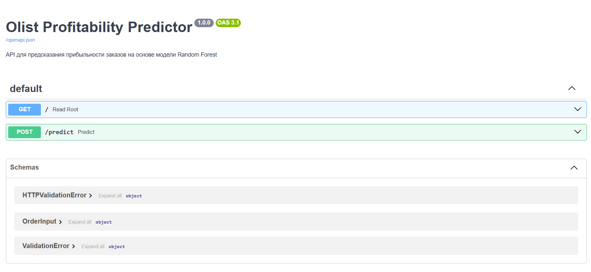
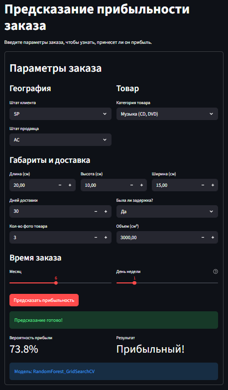
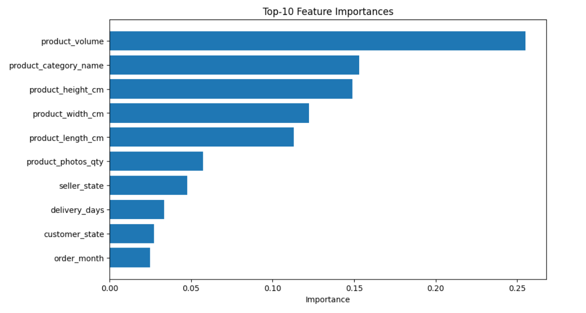
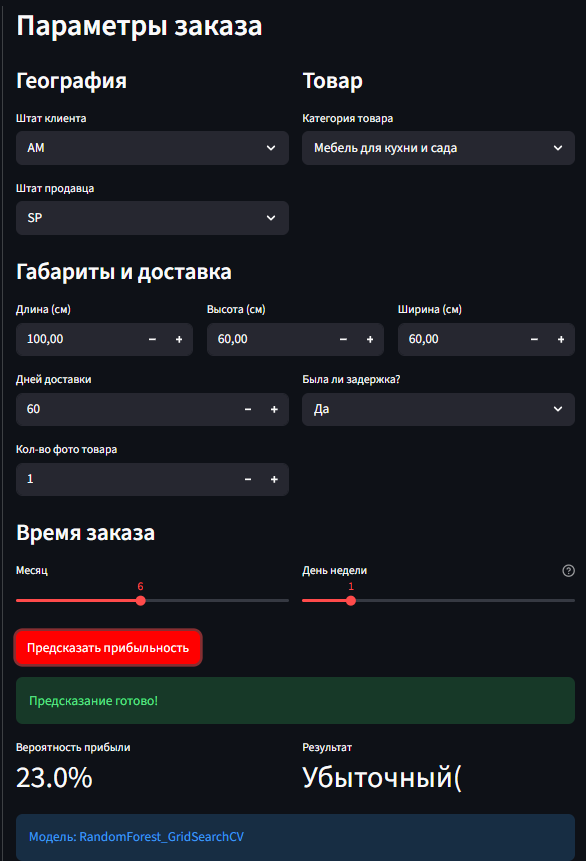

# Отчёт по проекту

**Студент:** [Горбунов Владислав Дмитриевич / Student ID]
**Группа:** БИВ233

---

## 1. Введение и постановка задачи

- **Цель проекта:** Разработка ML-модели для бинарной классификации заказов маркетплейса Olist насчет прибыльности. Проект направлен на помощь бизнесу в принятии решений: какие заказы приносят реальную прибыль с учетом логистики и себестоимости, а какие являются убыточными.
Формулировка задачи.
- **Формулировка задачи:** классификация
- **Обоснование метрики качества:** В качестве основной метрики выбран ROC-AUC.
Почему:
В данных может наблюдаться дисбаланс классов (прибыльных заказов может быть больше, чем убыточных, или наоборот, в зависимости от порога). 
1. Accuracy в таком случае вводит в заблуждение. Модель будет предсказывать мажоритарный класс и получать высокий результат.
2. ROC-AUC выбран как основная метрика потому что он показывает способность модели ранжировать объекты (отличать прибыльные заказы от убыточных) независимо от выбранного порога классификации.
3. Если бизнесу важнее не допустить убыточный заказ (FP), мы будем смотреть на Precision. Если важнее найти все потенциально прибыльные заказы, даже рискуя ошибиться, приоритет Recall. Для сбалансированной оценки используем ROC-AUC.

**Приоритеты при дисбалансе:**
- Если критично не пропустить убыточный заказ (ложноположительный) → фокус на **Precision**
- Если критично найти все прибыльные заказы (ложноотрицательный) → фокус на **Recall**  
- ROC-AUC выбран как сбалансированная метрика, независимая от порога классификации

---

## 2. Поиск и описание данных

- **Источник данных:** описано в README
- **Описание датасета:**
  - Объём: 100к+ строк и 43 столбца, итого 12 признаков (после отбора)
  - Ссылка: https://www.kaggle.com/code/jayzainab/brazillian-e-commerce
  - Лицензия: CC BY-SA 4.0
  - Описание признаков (типы, смысл)
### Описание признаков

| Признак | Тип данных | Смысл / Описание |
|---------|-----------|-----------------|
| `delivery_days` | int32 | Время доставки в днях (разница между датой покупки и фактической доставкой). Для недоставленных заказов = -1 |
| `is_delayed` | int32 (0/1) | Бинарный флаг: 1 — доставка произошла позже плановой даты, 0 — вовремя или не доставлен |
| `product_length_cm` | float32 | Длина товара в сантиметрах |
| `product_height_cm` | float32 | Высота товара в сантиметрах |
| `product_width_cm` | float32 | Ширина товара в сантиметрах |
| `product_photos_qty` | int32 | Количество фотографий товара в карточке |
| `customer_state` | int32 (encoded) | Кодированный штат покупателя (LabelEncoder: 0, 1, 2...) |
| `seller_state` | int32 (encoded) | Кодированный штат продавца (влияет на логистические расходы) |
| `product_category_name` | int32 (encoded) | Кодированная категория товара (71 уникальная категория) |
| `product_volume` | float32 | Расчетный признак: `длина * высота * ширина`. Прокси для логистических издержек |
| `order_month` | int32 (1-12) | Месяц оформления заказа (учёт сезонности) |
| `order_dayofweek` | int32 (0-6) | День недели оформления заказа (0 = понедельник) |

### Целевая переменная

| Признак | Тип | Описание |
|---------|-----|----------|
| `target` | int32 (0/1) | Бинарная метка прибыльности: **1** — маржинальность ≥ 20%, **0** — иначе. Рассчитывается как `(price - (product_weight_g * 0.02 + freight_value)) / (total_cost + ε) >= 0.2` |

---

## 3. Обработка и подготовка данных

- **Полная очистка:**
  - Пропуски: Обрнаруживал простым .isnull().sum(). Нашлись в таблицах review, orders, products. Наличие пропусков в review нормально, не все пользователи оставляют заказы на все свои товары. Стратегия обработки простая - не трогаем, все равно в модели не используем отзывы. В таблице orders пропуски в датах доставки, стратегия обработки следующая - не заполнять, а создать бинарные признаки (is_delivered, is_approved, delivery_days, is_delayed). В таблице products пропуски были в характеристике товаров, стратегия обработки - категории заменить на 'unknown', а числовые на медиану или 0.
  Пропуски в датах доставки (order_delivered_customer_date) отражают статус заказа (еще не доставлен/отменен). Заполнение средним исказило бы логику, поэтому созданы бинарные признаки.
  Для габаритов товаров использована медиана, так как это сохраняет распределение, а заполнение нулем могло бы создать артефакты для тяжелых товаров.
  
  - Дубликаты: Проверял простым .duplicate().sum(). Дубликаты обнаружены только в геолокации, это нормально, заказы могли доставляться на один адрес, или улицу или почтовый индекс и тд. В остальных столбцах дубликатов нет, все в норме.
  - Выбросы: Метод обнаружения - визуальный анализ ящика с усами, далее статистический метод IQR и метод Z-score. Стратегия обработки - Выбросы не удалялись, так как в e-commerce они отражают реальные бизнес-кейсы (дорогие товары, тяжелая мебель, удаленная доставка). Для моделей, чувствительных к масштабу (логистическая регрессия, SVM), в будущем может применяться np.clip() или логарифмирование. Для Random Forest и Gradient Boosting выбросы не критичны, так как деревья работают с ранжированием, а не абсолютными значениями.
  - Типы данных: Числовые приводим к 'int32' или 'float32', категориальные к 'category', даты соответственно в datetime.
- **Работа с фичами:**
  - Исходное количество признаков 
    После слияния 7 таблиц (orders, order_items, products, customers, sellers, order_payments, category_name_t) мы получили 40 признаков. Для модели мы взяли только 12.
  - Новые фичи, feature engineering (какие созданы и зачем)
- **Визуализации:** 
    1. Boxplot числовых признаков - Сильно скошенное распределение большинство товаров дешевые, выбросы у нас это реальные дорогие заказы.
    2. Распределение клиентов по штатам - видно, что 82% из Сан-Паулу, значит модель может быть смещена в сторону этого региона.
    3. Корреляционная матрица - Высокая корреляция между price и payment_value (ожидаемо). Мультиколлинеарность не критична для деревьев.
    4. Зависимость целевой переменной от прибыльности заказа - Некоторые категории (например, электроника) имеют более высокую долю прибыльных заказов.

- **Сплит данных:**
  - Стратегия разбиения - временной сплит, не случайный. Потому что заказы имеют временнУю природу, цены, логистика и поведение клиентов постоянно меняются, в зависимости от времени и условий рынка. Соотношение - train 80%, test 20%.
  - Избегание data leakage:
    1. Изменили grain для order_payments до order_id, чтобы при мерже избежать клонирования строк.
    2. Не используем review_score, так как он считается признаком из будущего.
    3. Признаки price, freight_value, product_weight_g оставлены, так как они известны на момент оформления заказа. Для "честного" теста проведена оценка без них.
    4. Временной порядок - модель обучается на данных прошлого и предсказывает данные будущего.

---

## 4. Baseline-модель

- **Модель:** RandomForest
- **Результаты:** 0.7851
- **Цель:** точка отсчёта для сравнения с более сложными моделями

---

## 5. Эксперименты

Для каждого эксперимента - формат: **Гипотеза** → **Как проверялось** → **Результат** + метрики в таблице.

- **Минимум 4–5 моделей** + ансамбли (RandomForest, XGBoost/LightGBM и др.)
- **Перебор гиперпараметров:** какие методы использовались и какие параметры перебирали
- **Уменьшение размерности:** если фич много - эксперименты с PCA/другими методами, визуализация
- **Таблица экспериментов:** пример как может выглядеть таблица

| Модель | Гипотеза | Параметры | ROC-AUC | Комментарий |
|--------|----------|-----------|-----------|-------------|
| Logistic Regression    | Линейные зависимости дадут быструю интерпретацию      | max_iter=2000, random_state = 2804     | 0.6688       |  Низкий результат: данные нелинейны, признаки требуют нелинейных разделителей         |
| KNN | Близкие по характеристикам заказы имеют схожую маржу | n_neighbors = 5 | 0.6685 | Чувствителен к масштабу и шуму категорий |
| SVM | Линейная граница разделит классы | kernel="linear", probability=True | 0.6585 |  Не подходит для табличных данных |
| Gradient Boosting | Последовательное исправление ошибок улучшит качество | n_estimators=100, n_jobs=-1, random_state = 2804 | 0.7477 |  Требует тонкой настройки, склонен к переобучению на малых lr |
| Random Forest | Ансамбль деревьев устойчив к выбросам и не требует скейлинга | random_state = 2804 | 0.8045 | Лучший выбор, стабильная модель и подходит для табличных данных |

## Сравнение моделей машинного обучения

| Модель | Лучшие параметры | ROC-AUC | Вывод |
|:-------|:----------------|:-------------|:------|
| Random Forest (Tuned) | n_estimators=300, max_depth=20 | 0.8463 | Прирост хороший. Глубина 20 ловит сложные взаимодействия без переобучения |
| Gradient Boosting (Tuned) | lr=0.05, max_depth=11, n_est=200 | 0.8375 |  Низкий lr + много итераций дают стабильность, но уступает RF |
| KNN (Tuned) | n_neighbors=11 со скейлингом и 7 без скейлинга | 0.7075 / 0.7700 | Скейлинг ухудшил результат: данные без масштабирования лучше отражали важность объёма или доставки |

---

## 6. Финальная модель и интерпретируемость
- Финальная модель - Random Forest.
- **Обоснование выбора финальной модели:** У нее наивысший ROC-AUC (~0.84) и она устойчива к пропускам и выбросам.
- **Интерпретируемость:** важность признаков (feature importance), коэффициенты - что можно сказать о влиянии фич на предсказание
- Топ 7 важных признаков: 
1. product_volume (25.5%) -> ключевой фактор, потому что больше объем -> больше стоимость доставки -> меньше маржа
2. product_category_name (15.3%) -> разные категории имеют разную наценку и тд
3. product_height/width/length (суммарно ~38%) -> габариты определяют тарифы перевозки (аналогично объему)
4. seller_state / delivery_days -> география и скорость логистики вторичны, но значимы 
- Модель подтверждает, что логистика (в тч размер) и категория товара это главные драйверы маржи. Оптимизация тарифов на тяжёлые/объёмные позиции и пересмотр ассортимента в низкомаржинальных категориях дадут наибольший эффект.

---

## 7. Деплой

- **Интерфейс:** В рамках текущего этапа не реализован графический интерфейс, но архитектура кода модульная (src/preprocessing.py, функции build_dataset, train_model), что позволяет быстро обернуть пайплайн в FastAPI или Streamlit.
- Воспроизводимость:
  1. Версии библиотек зафиксированы в requirements.txt.
  2. Проект контейнеризован: Dockerfile и docker-compose.yml обеспечивают идентичное окружение.
  3. Линтинг настроен через Makefile (make lint).

### API (FastAPI)

API доступно по адресу `http://127.0.0.1:8000/docs`:

*Рисунок 1 — Swagger документация API*

### Веб-интерфейс (Streamlit)

Интерфейс доступен по адресу `http://127.0.0.1:8501`:

*Рисунок 2 — Интерфейс для ввода параметров заказа (на примере прибыльного заказа)*

### Важность признаков

*Рисунок 3 — Топ-10 наиболее важных признаков*

### Пример работы

*Рисунок 4 — Пример предсказания прибыльности заказа (на примере убыточного заказа)*

### Видео демонстрации

[Ссылка на видео] [Google Disk](https://drive.google.com/...)

---

## 8. Заключение и выводы

- **Итоги:** Модель RF по сравнению с Baseline выросла: 0.78 -> 0.80 -> 0.84 и стала лучшей моделью этого проекта! Random Forest показал наилучший результат потому что такова природа задачи и датасета: прибыльность заказа определяется нелинейными взаимодействиями признаков (объём * категория * регион * логистика), которые деревья фиксируют автоматически. В отличие от линейных моделей (Logistic Regression, SVM), RF не требует явного создания полиномиальных признаков и устойчив к различию масштабов. В отличие от метрических методов (KNN), RF не искажает расстояния из-за ordinal-кодирования категориальных переменных. Gradient Boosting показал сопоставимый результат (0.836), но уступил из-за ограниченного пространства поиска гиперпараметров и большей чувствительности к шуму без дополнительной регуляризации. Таким образом, для табличных данных e-commerce с разнородными признаками и сложными зависимостями ансамбли деревьев являются оптимальным выбором.

- **Ограничения:** Вообще в этом проекте хотел сделать гораздо больше, но не хватило времени. Мб к CP3 поделаю еще что-то (кроме исправления имеющихся недостатков).

- **Возможные улучшения:** Добавить интерфейс (возможно до защиты сделаю) и проверить на других метриках (это успею к CP3). 
